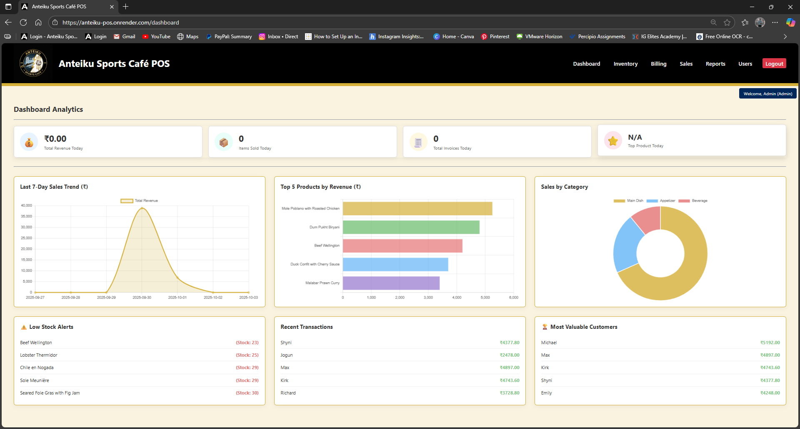
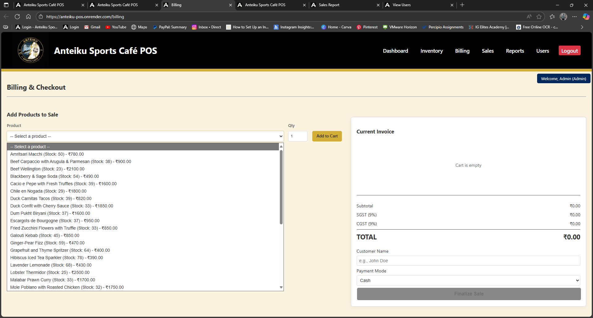
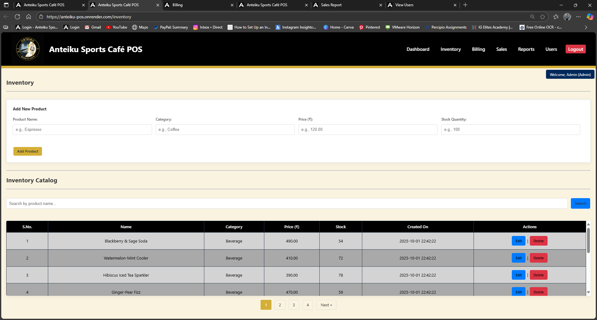
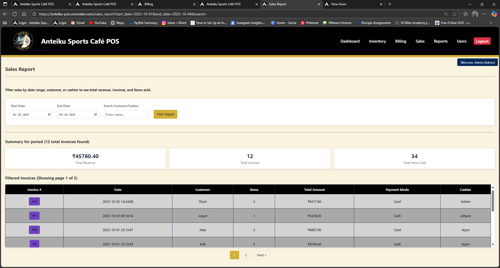
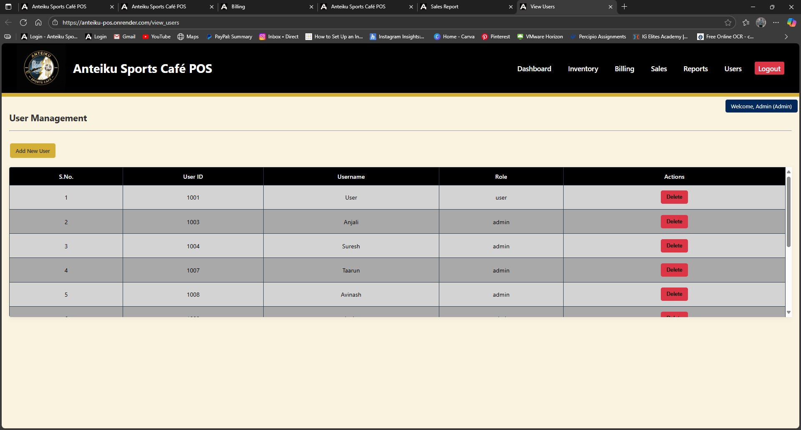
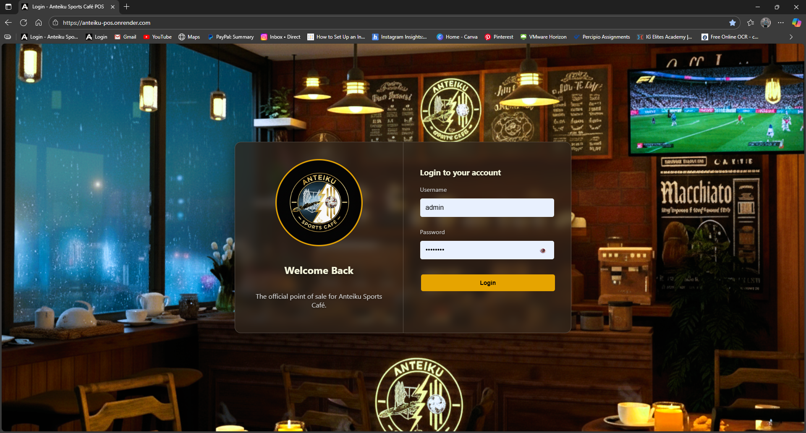
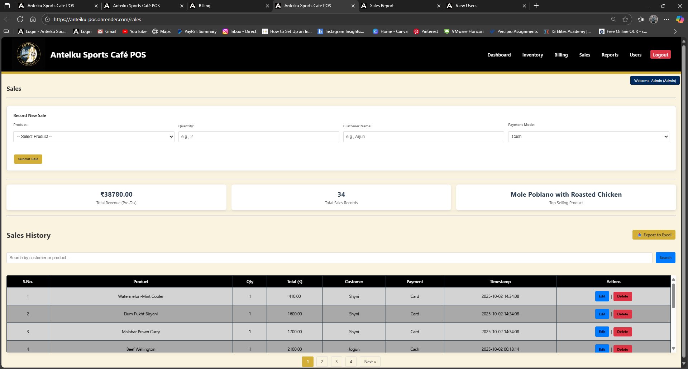
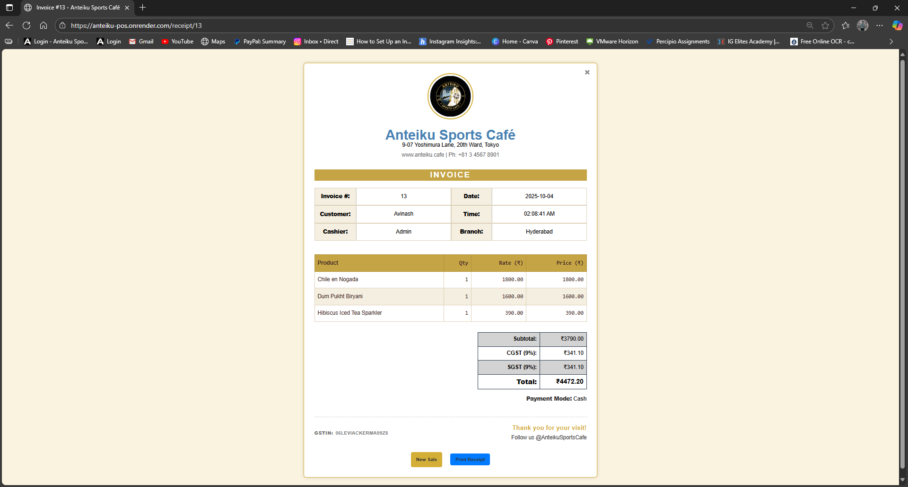

# Anteiku Sports Café - POS System

A lightweight, web-based Point of Sale (POS) application built with Python and Flask. Designed for a small café to efficiently manage sales, inventory, and users with role-based access control.

---

### ► Live Demo
[Live Application Deployed on Render](https://anteiku-pos.onrender.com/)`
**[Click here to watch the full demo on YouTube](https://youtu.be/U0lnMlQewEQ)**

---

### ► Screenshots

| Dashboard | Billing Page | Inventory Management | Sales Report |
| :---: | :---: | :---: | :---: |
|  |  |  |  |
| **Main analytics dashboard.** | **Interactive multi-item billing.** | **Full product and stock control.** | **Advanced, filterable sales reports.** |

| User Management | Login Page | Sales History | Printable Invoice |
| :---: | :---: | :---: | :---: |
|  |  |  |  |
| **Tiered user role management.** | **Secure login with session control.** | **Detailed record of all sales.** | **Branded, print-friendly invoice.** |

---

### ► Features

- **Secure Authentication**: Role-based access control (RBAC) with 'Admin' and 'User' roles, using password hashing.
- **Inventory Management**: Full CRUD (Create, Read, Update, Delete) functionality for products with automatic stock tracking.
- **Multi-Item Billing**: A dynamic cart system for processing transactions with multiple items and tax calculation.
- **Interactive Dashboard**: A comprehensive dashboard featuring:
  - Daily sales metrics (Revenue, Items Sold, Invoices, Top Product).
  - Charts for 7-day sales trends, top 5 products by revenue, and sales by category.
  - Actionable widgets for low stock alerts and recent transactions.
- **Sales Reporting**: An advanced, filterable report page for analyzing sales data by date range, customer, or cashier, with pagination.
- **Printable Receipts**: Professional, branded, and print-friendly receipts generated for every transaction.

---

### ► Technology Stack

- **Backend**: Python 3, Flask
- **Frontend**: HTML, CSS, Vanilla JavaScript, Jinja2
- **Database**: SQLite
- **Key Libraries**:
  - Werkzeug (for password hashing)
  - Chart.js (for data visualization)
  - Toastify.js (for notifications)
- **Deployment**: Gunicorn, Render

---

### ► Local Setup and Installation

Follow these steps to get the application running on your local machine.

**Prerequisites:**
- Python 3.x
- `pip`

**1. Clone the Repository**
```bash
git clone [https://github.com/your-username/your-repo-name.git](https://github.com/arjunsuresh1804-hub/POS-Project)
cd your-repo-name
2. Create and Activate a Virtual Environment

On macOS/Linux:

Bash

python3 -m venv venv
source venv/bin/activate
On Windows:

Bash

python -m venv venv
.\venv\Scripts\activate
3. Install Dependencies

Bash

pip install -r requirements.txt
4. Set Up the Database
Run the reset script to create the POS.db file and populate it with a default admin user and sample products.

Bash

python reset_db.py
5. Configure Environment Variables
This project uses environment variables to keep sensitive data like the secret key secure.

Create a file named .env in the root of the project folder.

Add your secret key to this file:

SECRET_KEY='your_own_super_secret_and_random_key'
6. Run the Application
Start the Flask development server.

Bash

flask run
The application will be available at [http://127.0.0.1:5000](http://127.0.0.1:5000).

► Usage
Admin Login:

Username: admin

Password: admin123

After logging in, you can add new users, manage the full inventory, and view all reports. It is highly recommended to change the default admin password.

► Deployment
This application is configured for deployment on a platform like Render.

Push your project to a GitHub repository.

On Render, create a new "Web Service" and connect it to your repository.

Set the Start Command to gunicorn app:app.

Add your SECRET_KEY under the "Environment" variables.

If using PostgreSQL on Render, add a DATABASE_URL environment variable and update app.py to use it.

► Future Improvements
[ ] Database Migration: Transition from SQLite to PostgreSQL for a more robust production environment.

[ ] Enhanced Analytics: Add more advanced filtering options to the dashboard (e.g., "this month vs. last month").

[ ] Mobile Responsiveness: Improve the layout for usability on mobile devices.